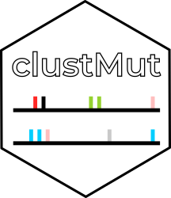

clustMut 
========================================================

The goal of clustMut is to call clustered mutations in sets of somatic mutations.
A clustered mutation is defined as the result of a local _hyper_-mutation event.

This package uses XXX different statistics to compute and detect those events.

* Chromosomic distance - Need a randomized version of the sample that you can generate using [randommut](http://fsupeksvr.irbbarcelona.pcb.ub.es/gitlab/dmas/randommut).
* Allele Frequency
* Edit distance between mutations

## Installation

Install the package using the following command. Note that is needed to install genomicHelpersDMP manually from its repository [here](http://fsupeksvr.irbbarcelona.pcb.ub.es/gitlab/dmas/genomicHelpersDMP)

```bash
install.packages(c("devtools","getPass"))
devtools::install_git(
  "http://fsupeksvr.irbbarcelona.pcb.ub.es/gitlab/dmas/clustMut.git", 
  credentials = git2r::cred_user_pass("dmas", getPass::getPass()),
  branch = "dev"
)
```

Then, move the script to run to your `bin` or to a folder available in your `$PATH`.
This is a one time only action, when you update your package the new version will be available from the same script.


```bash
cp clustmut_run.sh ~/bin/
```

and give it execution permisions.

```bash
chmod +x script.sh
```

### Dependencies

R packages should be installed when instaling the package. No other packages are needed for the package. Bash and UNIX is required to run the shell script. 

## Usage

You can use clustmut to obtain kataegis events, clusters based on VAF or clustered mutations based on the Edit distance.
Run it with the appropiate mode command.

### VAF

```bash
clustmut_run.sh -i /home/dmas/data/TCGA_MUTS/TCGA_VR/ \
                --glob "*_VR.rds" \
                --recursive \
                --mode vaf \
                -a ~/data/CRG_alignability/hg19/LEGACY/crg36AlignExtNoBlackRmvsh19_RngMask_savedInt\=TRUE.bed \
                -o test \
                -Vlwtvu
```

### distance (difuse clusters)

```bash
clustmut_run.sh -i /home/dmas/data/TCGA_MUTS/RNDmut/ \
                --glob "*randomized.tsv" \
                --recursive \
                --mode distance \
                -o test_omichili \
                -N 1 \
                -Vlwtvu
```

### distance (kataegis)

```bash
clustmut_run.sh -i /home/dmas/data/TCGA_MUTS/RNDmut/ \
                --glob "*randomized.tsv" \
                --recursive \
                --mode distance \
                -o test_kataegis \
                -N 4 \
                -Vlwtvu
```

### edit

```bash
clustmut_run.sh -i /home/dmas/data/TCGA_MUTS/TCGA_VR/ \
                --glob "*_VR.rds" \
                --recursive \
                --mode edit \
                -a ~/data/CRG_alignability/hg19/LEGACY/crg36AlignExtNoBlackRmvsh19_RngMask_savedInt\=TRUE.bed \
                -o test \
                -Vlwtvu
```
